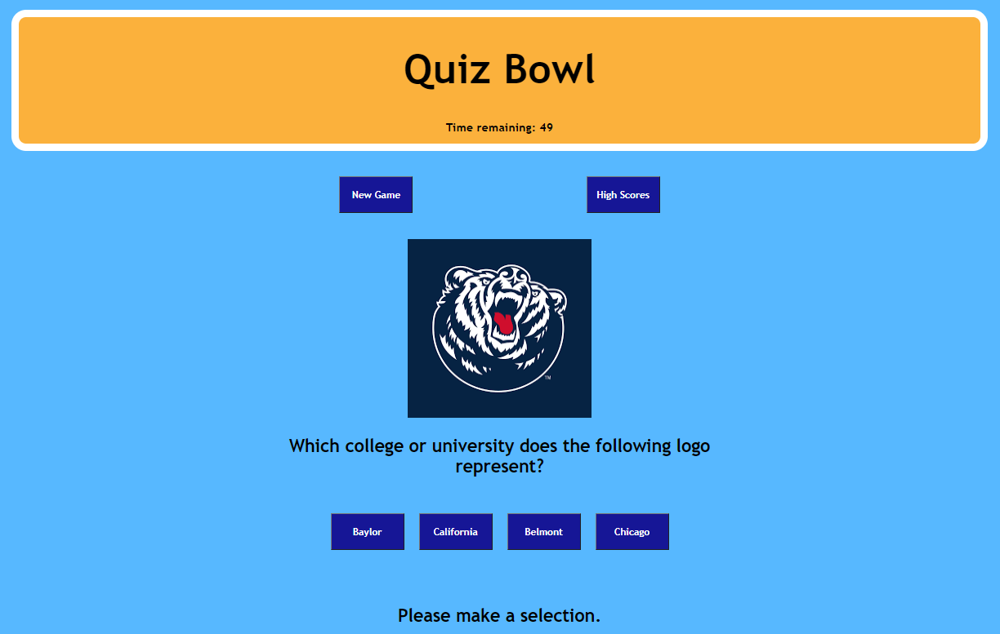

# QuizBowl

Description
------------

Program quizzing users about obscure college logo and who they belong to. The program starts when you hit the New Game button. Once hit a timer will start and you'll be preseneted with a logo from a college. You will be given four options to choose from. If you miss a question the timer will go down by 10. Once it reaches 0, or you've answered all the questions the game ends and you'll be prompted to enter your name to be put on the high scores list. The high scores list is on a separate page that relies on local storage to pull in the ordered list of scores.

The site can be seen using the following URLs: 

* https://kjphelps90.github.io/QuizBowl/

* https://kjphelps90.github.io/QuizBowl/highscore.html

Author(s)
------------

* HTML, CSS, Javascript  - Kevin Phelps

Version history
------------

0.1 - Inital Release

Preview
------------

